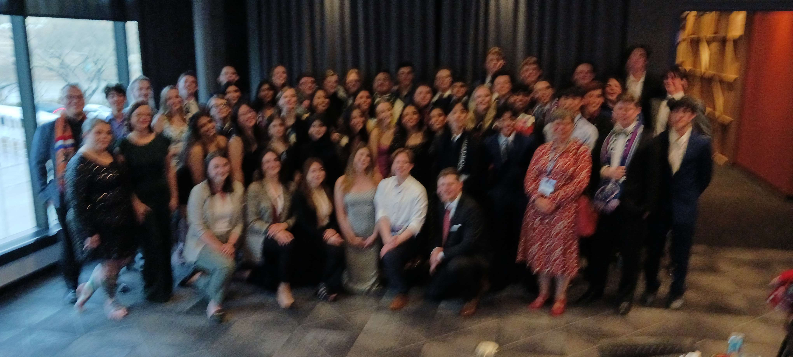

<h1 align="center">
    
</h1>

<!-- TABLE OF CONTENTS -->

  
Table of Contents

  <ol>
    <li>
      <a href="#About-My-Campaign">About My Campaign</a>
    </li>
    <li>
      <a href="#Why-You-Should-Vote-For-Me">Why You Should Vote For Me</a>
      <ul>
        <li><a href="#What-I-Bring-To-The-Table">What I Bring To The Table</a></li>
        <li><a href="#What-I-Intend-To-Change">What I Intend To Change</a></li>
      </ul>
    </li>
    <li><a href="#Pictures">Pictures</a></li>
      <ul>
        <li><a href="#Executive-Meeting-2023-Saskatoon">EM 2023</a></li>
        <li><a href="#Annual-General-Meeting-and-Retreat-2023-Winnipeg">AGMR 2023</a></li>
        <li><a href="#Okanagan-Engineering-Competition-2023-Kelowna">OEC 2023</a></li>
        <li><a href="#Western-Engineering-Competition-2024-Winnipeg">WEC 2024</a></li>
        <li><a href="#Conference-on-Sustainability-in-Engineering-2024-Toronto">CSE 2024</a></li>
        <li><a href="#Canadian-Engineering-Competition-2024-Calgary">CEC 2024</a></li>
      </ul>
    <li><a href="#Final-Exam-Jam-Playlist">Final Exam Jam Playlist</a></li>
    <li><a href="#Other-Relevant-Stats">Other Relevant Stats :sunglasses:</a></li>
    <li><a href="#Contact">Contact</a></li>
  </ol>

## About My Campaign

The Okanagan Engineering Society, or EngSoc, is the student engineering represenative body of UBCO. I am the current Vice-President Internal of the EngSoc this year and am running to be the new President for the upcoming year. You can check out our instagram page here: 

[@okanaganengsoc](https://www.instagram.com/okanaganengsoc?igsh=ZGx3Ymp5NzFnb3Jn)

(<a href="#readme-top">back to top</a>)

## Why You Should Vote For Me

### What I Bring To The Table

1. ***Past Executive Experience:*** Serving as ***VP Internal*** this year
2. Served as ***UBCO’s Head Delegate*** and attended various ***Engineering Conferences*** in ***Toronto***, ***Winnipeg***, and ***Saskatoon***
3. Organised the ***Okanagan Engineering Competition (OEC)*** on campus
4. One of our student teams that qualified from OEC went on to secure the ***Runner’s Up Position*** in the ***Canadian Engineering Competition*** in ***Calgary***

### What I Intend To Change

1. Implement a ***faster mode of operation***
2. Throw more ***non-engineering related events*** like ***Avalanche***
3. Do more ***club/frat*** collaborations
4. Provide timely & equitable ***funding***

(<a href="#readme-top">back to top</a>)

## Pictures

### Executive Meeting 2023 Saskatoon

Photographer messed up :skull:

### Annual General Meeting and Retreat 2023 Winnipeg

### Okanagan Engineering Competition 2023 Kelowna

### Western Engineering Competition 2024 Winnipeg

### Conference on Sustainability in Engineering 2024 Toronto

### Canadian Engineering Competition 2024 Calgary

(<a href="#readme-top">back to top</a>)

## Final Exam Jam Playlist

(<a href="#readme-top">back to top</a>)

## Other Relevant Stats

If you have a suggestion that would make this better, please fork the repo and create a pull request. You can also simply open an issue with the tag "enhancement".

* Bench: 135 lbs
* Consequetive Keepie-Uppies: 56
* Chess Elo (Rapid): ~900
* Fork the Project

(<a href="#readme-top">back to top</a>)

## Contact

<h3 align="center">⚡You can Connect With Me here:</h3>
 

 
  
  
  

(<a href="#readme-top">back to top</a>)

